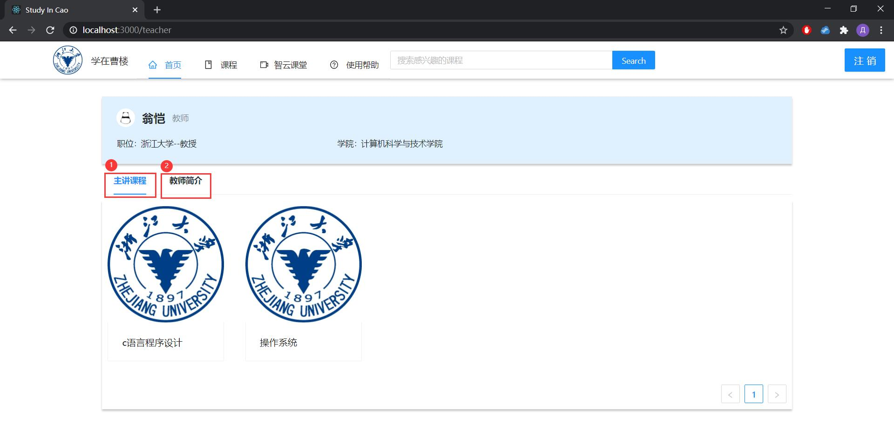
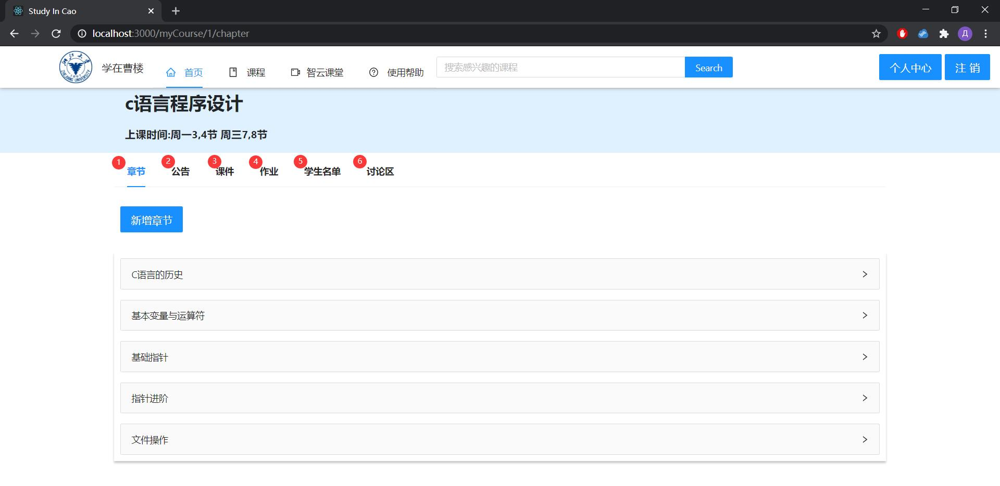
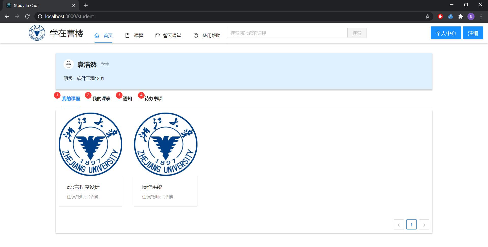
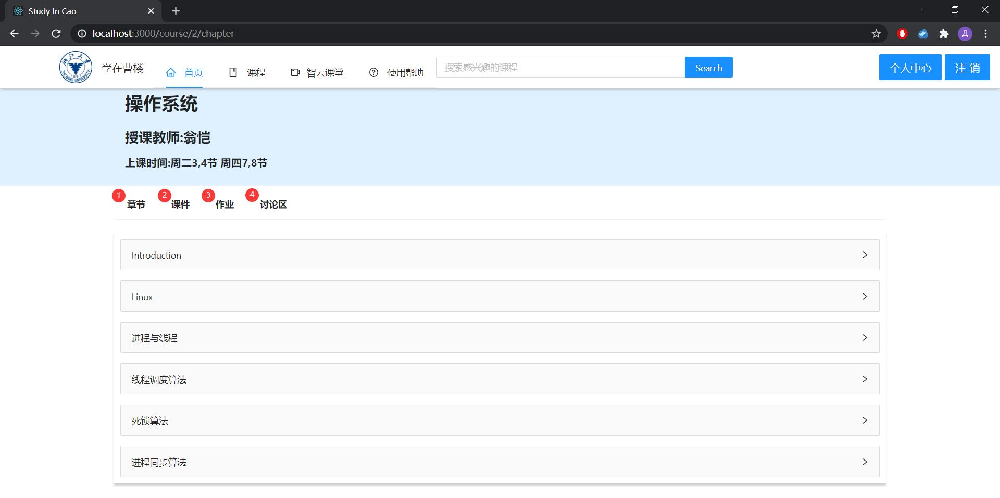

# 学在曹楼 使用手册

## 教师部分

### 个人后台页面

1. 主讲课程：展示教师教授的所有课程，点击可前往该课程的管理页面

2. 教师简介：展示教师基本个人信息，在该页面教师也可修改部分个人资料

### 课程管理页面

1. 章节：教师可为该课程设置章节

2. 公告：教师可发送公告给全部选课学生

3. 课件：教师可选择不同的章节，上传课件等教学资料

4. 作业：教师可为全部选课学生设置新的作业

5. 学生名单：教师可查看全部选课学生名单

6. 讨论区：进入该课程的公共讨论区

## 学生部分

### 个人后台页面

1. 我的课程：学生可查看自己选上的全部课程，点击可前往该课程的学习页面

2. 我的课表：学生可查看自己各个学期的课程表

3. 通知：学生可收到教师上传课程资料、发布新作业的通知

4. 待办事项：学生可查看自己未完成的作业

### 课程学习页面

1. 章节：学生可查看该课程的章节信息，包括该章节相关的课程资料和作业

2. 课件：学生可查看本课程的全部课程资料

3. 作业：学生可查看并提交本课程的全部作业

4. 讨论区：进入该课程的公共讨论区